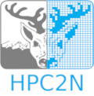

# Introduction to Linux - April 2025

## Course description

This NAISS/HPC2N course is an introduction to Linux, which is what is used on most Swedish HPC centers and indeed on the vast majority of HPC clusters worldwide. 

It is meant for beginners to the Linux operating system.

The registration and schedule is here: [https://www.hpc2n.umu.se/events/courses/2025/spring/2/linux-intro ](https://www.hpc2n.umu.se/events/courses/2025/spring/2/linux-intro)

Materials: Clone this repo or download a zip of the material (click the green "Code" button then pick "Download ZIP"). 

Lecture recordings: https://www.youtube.com/watch?v=ScMjWTZvtag&list=PL6jMHLEmPVLzoudy66m5isl2LD-YY_05L

**Lecture recordings from the current course will be posted to HPC2N's YouTube page:** https://www.youtube.com/user/HPC2N

Date: 3 April 2025

Time: 09:00-12:00

Location: Online (ZOOM). Link is sent to registered participants a few days before the course. 

 

