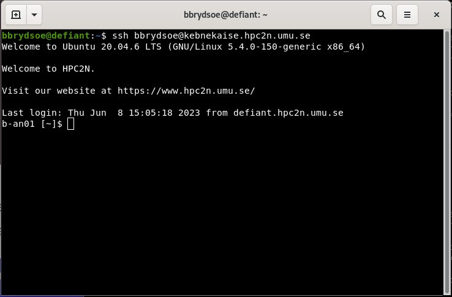

# The command line

{: style="width: 400px;float: right"}

The command line is an interface for typing commands directly to a computer's operating system. It is a user interface that is navigated only with the keyboard, by typing commands at a prompt, instead of by clicking with a mouse or similar. 

The Command Line Interface (CLI) is available in all operating systems, including Windows, Linux and macOS, but it is most commonly associated with Linux. 

!!! NOTE 

    In Unix or Linux, the prompt may be shown as "%" or ">" depending on the shell.

The opposite of a <code>CLI</code> is a <code>GUI</code> (Graphical User Interface), which generally uses a mouse or similar for navigating. 

Command line interfaces often gives access to many more capabilities than the graphical user interface does, and it is also practical and normally faster in situations where you login with a terminal on a remote system, like Kebnekaise. 

The picture above shows a terminal window where I am logged into Kebnekaise (from my desktop defiant). 

!!! Warning 

    You will find that many/most commands in this tutorial are prefaced with either <code>\$</code> or <code>b-an01 [~]\$</code>, or something like <code>b-an01 [~/mytestdir/testdir1]\$</code>. 

    This is the prompt from the computer system, where <code>\$</code> just is the default (<code>bash</code>) prompt, and the others are the actual prompt you will see when logged into the regular login node of Kebnekaise (home directory versus a sub directory that in this case is named <code>testdir/testdir1</code>).

    You can see this prompt in the picture a bit further up on the page. 

    Do **NOT** copy this prompt if you are copying code snippets. It should not be included in the command. 

!!! Exercise "Exercise: Open a terminal" 

    Do one of the following: 

    1. Tetralith
        - Use an SSH client of your choice or <a href="http://www.cendio.com/thinlinc/what-is-thinlinc" target="_blank">ThinLinc</a>
        - Log in with your USERNAME: 
        ```bash
        ssh USERNAME@tetralith.nsc.liu.se
        ```
        - If you logged in with ThinLinc, open a terminal
    2. Any other HPC system of your choice
    3. Open a terminal on your own computer 

!!! Exercises "Code-along: try a few commands"

    NOTE: These commands will all be described in more details in the next section about [Navigating the File System](filesystem) 

    List some files and directories:
    ```bash
    ls
    ```

    Create a file:
    ```bash
    touch MYFILE.txt
    ```

    Create a directory:
    ```bash
    mkdir MYDIR
    ```

   List your files and directories again: 
   ```bash
   ls
   ```
 
