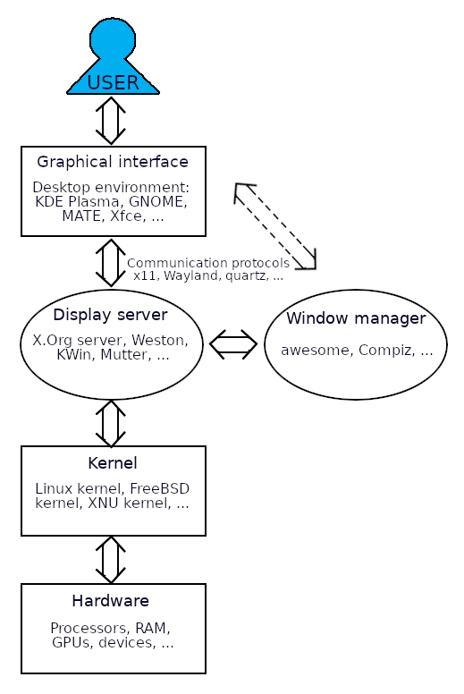

# Overview of Linux system

This is a brief overview of how the parts of a Linux system go together: 

{: style="width: 400px;float: right;padding: 3px;}

To read more about the terms, go to the [Linux terminology](../linux-terminology) section under "EXTRAS". 
