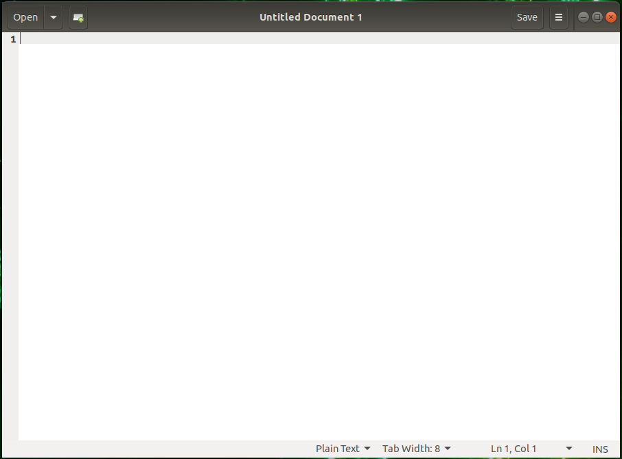

# Editors 

!!! note "Learning objectives"

    **Questions**

    - Which editors are good to use on the command line?
    - Which editors are good for using in a GUI (graphical user interface) environment? 

    **Objectives** 

    - Learn about some command line editors
    - Try and use ``nano``
    - Learn about some GUI editors
    - Try use ``gedit`` 

Some editors are more suited for a GUI environment and some are more suited for a command line environment. 

!!! note "less, more, cat - if you just need to see the content"

    If you just need to see the content of a file, these commands that was mentioned under the [Pipes and filters]() section are probably the best, since there is no risk of you making changes to the file if you are just looking in it. 

    - more: forward navigation and limited backward navigation in a file named FILE. Usage: more FILE
    - less: forward and backward navigation and also has search options. Usage less FILE
    - cat: a tool for file-related operations (view, concatenate, create, copy, merge, and manipulate file contents). Usage: cat [option] FILE where option is various optional options (hint: man cat for more info).

## Command line

These are all good editors for using on the command line: 

- <a href="https://www.nano-editor.org/" target="_blank">nano</a>
- <a href="https://en.wikipedia.org/wiki/Vi" target="_blank">vi</a>, <a href="https://en.wikipedia.org/wiki/Vim_(text_editor)" target="_blank">vim</a>
- <a href="https://www.gnu.org/software/emacs/" target="_blank">emacs</a>

Of these, <code>vi/vim</code> as well as <code>emacs</code> are probably the most powerful, though the latter is better in a GUI environment. The easiest editor to use if you are not familiar with any of them is <code>nano</code>. 

!!! Example "Nano"

    **HINT: code-along!** 

    1. Starting "nano": Type <code>nano</code> FILENAME on the command line and press <code>Enter</code>. FILENAME is whatever you want to call your file. 
    2. If FILENAME is a file that already exists, <code>nano</code> will open the file. If it dows not exist, it will be created.
    3. You now get an editor that looks like this:  
    {: style="width: 500px"}
    4. First thing to notice is that many of the commands are listed at the bottom. 
    5. The **^** before the letter-commands means you should press CTRL and then the letter (while keeping CTRL down). 
    6. Your prompt is in the editor window itself, and you can just type (or copy and paste) the content you want in your file.  
    7. When you want to exit (and possibly save), you press CTRL and then x while holding CTRL down (this is written CTRL-x or ^x). <code>nano</code> will ask you if you want to save the content of the buffer to the file. After that it will exit. 

    There is a <a href="https://www.nano-editor.org/dist/latest/nano.html" target="_blank">manual for <code>nano</code> here</a>.  

## GUI 

If you are connecting with <a href="https://www.cendio.com/thinlinc/download/" target="_blank">ThinLinc</a>, you will be presented with a graphical user interface (GUI). (For Tetralith, the server is ``tetralith.nsc.liu.se``). From within Thinlinc you can either open a terminal window/shell or you can choose editors from the menu. 

It differs a bit how Thinlinc looks depending on the centre, and it also differs which desktop environment they are running. For instance, NSC's Tetralith has the Xfce environment while HPC2N's Kebnekaise has MATE. 

Examples to open terminal: 

- HPC2N: "Applications" -> "System Tools" -> "MATE Terminal" 
- NSC: "Applications" -> "System" -> "Xfce Terminal"

To choose editors from the menu: 

- HPC2N: "Applications -> Accessories". 
- NSC: "Applications" -> Accessories" and "Applications" -> "Development". 

Regardless, this gives several editor options, of which these have a graphical interface:  

- HPC2N/NSC: <a href="https://help.gnome.org/users/gedit/stable/" target="_blank">Text Editor (gedit)</a>
- HPC2N: <a href="https://en.wikipedia.org/wiki/Pluma_(text_editor)" target="_blank">Pluma</a> - the default editor on the MATE desktop environments (that Thinlinc runs)
- HPC2N: <a href="https://en.wikipedia.org/wiki/Atom_(text_editor)" target="_blank">Atom</a> - no
t just an editor, but an <a href="https://en.wikipedia.org/wiki/Integrated_development_environment" target="_blank">IDE</a>
- HPC2N/NSC: <a href="https://www.gnu.org/software/emacs/" target="_blank">Emacs (GUI)</a>
- HPC2N/NSC (under "Applications" -> "Development"): <a href="https://en.wikipedia.org/wiki/NEdit" target="_blank">NEdit "Nirvana Text Editor"</a>

If you are not familiar with any of these, a good recommendation would be to use <code>Text Editor/gedit</code>. 

!!! Example "Text Editor/gedit"

    1. Starting "gedit": From the menu, choose Applications -> Accessories -> Text Editor.
    2. You then get a window that looks similar to this:   
    {: style="width: 400px"}
    3. You can open files by clicking "Open" in the top menu. 
    4. Clicking the small file icon with a plus (located beside the "Open" button") will create a new document. 
    5. Save by clicking "Save" in the menu. 
    6. The menu on the top right (the three horizontal lines) gives you several other options, including "Find" and "Find and Replace". 

!!! note "Keypoints"

    - Some editors are best for the command line and some are best for a GUI environment
    - ``nano`` is a good first editor for the command line
    - other editors for the command line are: ``vi``/``vim``, ``emacs``, etc. 
    - ``gedit`` (Text editor) is a good first editor for the GUI
    - other editors for a GUI environment are: ``Pluma``, ``Atom``, ``emacs (GUI)``, ``NEdit``, etc. 

