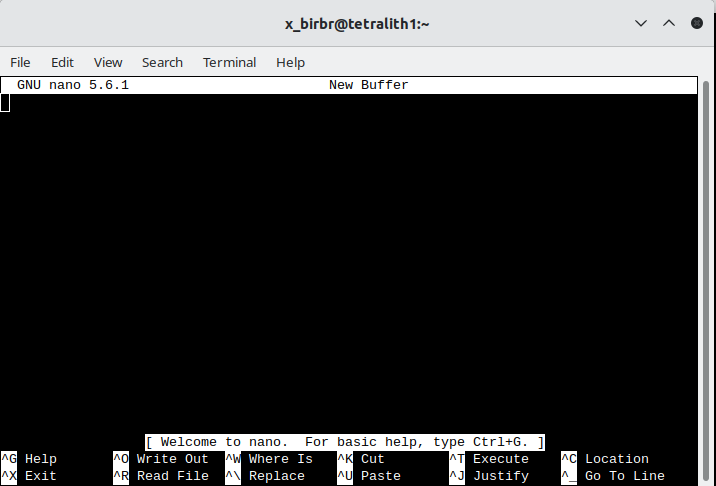

# Navigating the File System

This section is going to be a high-level talk about the Linux filesystem concepts, not a low-level description of filesystem types. 

{: style="width: 400px;float: right"}

The Linux filesystem directory structure starts with the top root directory, which is shown as <code>/</code>. Below this are several other standard directories. Of particular interest are <code>usr/bin</code>, <code>home</code>, <code>usr/lib</code>, and <code>usr/lib64</code>. A common directory which you will also often find is <code>usr/local/bin</code>. 

The picture on the right shows typical subdirectories under <code>/</code> (note that the command 'tree' does not work on Kebnekaise). Some of the directories have a symbolic link to a different name - this is often done to make it quicker to write, but can also be for compatibility reasons since some software have hardcoded paths. 

- **usr/bin**: contains (most) of the system-specific binaries
- **usr/local/bin**: non-system binaries. often locally compiled/maintained packages
- **home**: where the home directories of the users of the system are located
- **usr/lib**: kernel modules and shared library images needed to boot the system and run commands in the root filesystem
- **usr/lib64**: same as /lib, just for 64-bit libraries 

User-installed binaries are often located in **/opt**. 

## ls - listing files/directories

The ls command is used to list files. If you just give the command "ls" with no flags it will list all files in the current directory except for hidden files.

<div>
```bash
ls [flags] [directory]
```
</div>

This way you can to list files/subdirectories for any directory, but the default one is the one you are currently standing in. 

Some examples: 

- <code>ls /</code> lists contents of the root directory
- <code>ls ..</code> lists the contents of the parent directory of the current
- <code>ls ~</code> lists the contents of your user home directory
- <code>ls *</code> lists contents of current directory and subdirectories

Commonly used flags: 

- <code>-d */</code> lists only directories
- <code>-a</code> lists content including hidden files and directories
- <code>-l</code> lists content in long table format (permissions, owners, size in bytes, modification date/time, file/directory name)
- <code>-lh</code> adds an extra column to above representing size of each file/directory
- <code>-t</code> lists content sorted by last modified date in descending order
- <code>-tr</code> lists content sorted by last modified date in ascending order
- <code>-R</code> lists contents recursively in all subdirectories
- <code>-s</code> list files with their sizes
- <code>-S</code> sort files/directories by size in descending order
- <code>-Sr</code> sort files/directories by size in ascending order

To get more flags, type <code>ls \--help</code> or <code>man ls</code> in the terminal to see the manual. 

!!! Example "The output for a few of the flags, for a directory with two subdirectories and some files" 

    ```bash
    b-an01 [~/mytestdir]$ ls
    myfile.txt  myotherfile.dat  testdir1/	testdir2/
    
    b-an01 [~/mytestdir]$ ls -a
    ./  ../  myfile.txt  myotherfile.dat  testdir1/  testdir2/

    b-an01 [~/mytestdir]$ ls -l
    total 16
    -rw-r--r-- 1 bbrydsoe folk   90 Jun  9 14:19 myfile.txt
    -rw-r--r-- 1 bbrydsoe folk  101 Jun  9 14:19 myotherfile.dat
    drwxr-xr-x 2 bbrydsoe folk 4096 Jun  9 14:14 testdir1/
    drwxr-xr-x 2 bbrydsoe folk 4096 Jun  9 14:19 testdir2/

    b-an01 [~/mytestdir]$ ls -la
    total 24
    drwxr-xr-x  4 bbrydsoe folk  4096 Jun  9 14:19 ./
    drwxr-xr-x 49 bbrydsoe staff 4096 Jun  9 14:10 ../
    -rw-r--r--  1 bbrydsoe folk    90 Jun  9 14:19 myfile.txt
    -rw-r--r--  1 bbrydsoe folk   101 Jun  9 14:19 myotherfile.dat
    drwxr-xr-x  2 bbrydsoe folk  4096 Jun  9 14:14 testdir1/
    drwxr-xr-x  2 bbrydsoe folk  4096 Jun  9 14:19 testdir2/

    b-an01 [~/mytestdir]$ ls -lah
    total 24K
    drwxr-xr-x  4 bbrydsoe folk  4.0K Jun  9 14:19 ./
    drwxr-xr-x 49 bbrydsoe staff 4.0K Jun  9 14:10 ../
    -rw-r--r--  1 bbrydsoe folk    90 Jun  9 14:19 myfile.txt
    -rw-r--r--  1 bbrydsoe folk   101 Jun  9 14:19 myotherfile.dat
    drwxr-xr-x  2 bbrydsoe folk  4.0K Jun  9 14:14 testdir1/
    drwxr-xr-x  2 bbrydsoe folk  4.0K Jun  9 14:19 testdir2/

    b-an01 [~/mytestdir]$ ls -latr
    total 24
    drwxr-xr-x 49 bbrydsoe staff 4096 Jun  9 14:10 ../
    drwxr-xr-x  2 bbrydsoe folk  4096 Jun  9 14:14 testdir1/
    drwxr-xr-x  2 bbrydsoe folk  4096 Jun  9 14:19 testdir2/
    -rw-r--r--  1 bbrydsoe folk    90 Jun  9 14:19 myfile.txt
    -rw-r--r--  1 bbrydsoe folk   101 Jun  9 14:19 myotherfile.dat
    drwxr-xr-x  4 bbrydsoe folk  4096 Jun  9 14:19 ./

    b-an01 [~/mytestdir]$ ls *
    myfile.txt  myotherfile.dat

    testdir1:
    file1.txt  file2.sh  file3.c  file4.dat

    testdir2:
    file1.txt  file2.txt  file3.c

    b-an01 [~/mytestdir]$ cd testdir1
    b-an01 [~/mytestdir/testdir1]$ ls -l
    total 16
    -rw-r--r-- 1 bbrydsoe folk 24 Jun  9 14:16 file1.txt
    -rw-r--r-- 1 bbrydsoe folk 52 Jun  9 14:16 file2.sh
    -rw-r--r-- 1 bbrydsoe folk 82 Jun  9 14:17 file3.c
    -rw-r--r-- 1 bbrydsoe folk 40 Jun  9 14:17 file4.dat

    b-an01 [~/mytestdir/testdir1]$ ls -ls
    total 16
    4 -rw-r--r-- 1 bbrydsoe folk 24 Jun  9 14:16 file1.txt
    4 -rw-r--r-- 1 bbrydsoe folk 52 Jun  9 14:16 file2.sh
    4 -rw-r--r-- 1 bbrydsoe folk 82 Jun  9 14:17 file3.c
    4 -rw-r--r-- 1 bbrydsoe folk 40 Jun  9 14:17 file4.dat
    ```

    The "drwxr-xr-x" and "-rw-r\--r\--" are examples of permissions. The prefex d means is it a directory. A "-" means no permission for that. There are three groups: owner, group, and all. Note that “r” is for read, “w” is for write, and “x” is for execute.  

## chmod - change permissions 

The command <code>chmod</code> is used to change permissions for files and directories. 

!!! Note "There are three types of permission groups"

    - **owners**: these permissions will only apply to owners and will not affect other groups.
    - **groups**: you can assign a group of users specific permissions, which will only impact users within the group. The members of your storage directory belongs here. 
    - **all users**: these permissions will apply to all users, so be careful with this.

!!! Note "There are three kinds of file permissions"

    - Read (r): This allows a user or a group to view a file (and so also to copy it).
    - Write (w): This permits the user to write or modify a file or directory.
    - Execute (x): A user or a group with execute permissions can execute a file. They can also view a subdirectory.  

The permissions for a file, directory, or symbolic link has 10 "bits" and looks similar to this:

{: style="width: 400px}

As shown, the first bit can be "-" (a file), "d" (a directory), or "l" (a link). 

The following group of 3 bits are for the owner, then the next 3 for the group, and then the last 3 for all users. Each can have the r(ead), w(rite), and (e)x(ecute) permission set. 

!!! Note "To change permissions, here are some examples" 

    - owner
        - **chmod +rwx FILE/DIR** to add all permissions of a file with name FILE or a directory with name DIR
        - **chmod -rwx FILE/DIR** to remove all permissions from a file with name FILE or a directory with name DIR 
        - **chmod +x FILE** to add executable permissions
        - **chmod -wx FILE** to remove write and executable permissions
    - group
        - **chmod g+rwx FILE** to add all permissions to FILE 
        - **chmod g-rwx FILE** to remove all permissions to FILE
        - **chmod g+wx FILE** to give write and execute permissions to FILE
        - **chmod g-x FILE** to remove execute permissions to FILE
    - others
        - **chmod o+rwx FILE** to add all permissions to FILE
        - **chmod o-rwx FILE** to remove all permissions to FILE
        - **chmod o+w FILE** to add write permissions to FILE
        - **chmod o-rwx DIR** to remove all permissions to DIR 
    - all
        - **chmod ugo+rwx FILE/DIR** to add all permissions for all users (owner, group, others) to file named FILE or directory named DIR
        - **chmod a=rwx FILE/DIR** same as above
        - **chmod a=r DIR** give read permissions to all for DIR 

## chown - change ownership

To change ownership of a file or directory, use the command <code>chown</code>. 

<div>
```bash
chown [OPTIONS] USER[:GROUP] FILE(s)
```
</div>

!!! Note "Examples"

    - <code>chown USERNAME FILE</code> the user with USERNAME becomes the new owner of FILE
    - <code>chown USERNAME DIRECTORY</code> the user with USERNAME becomes the new owner of DIRECTORY (but not any subdirectories)
    - <code>chown USERNAME:folk DIRECTORY</code> the user ownership is changed to USER and the group ownership to group "folk" for the directory DIRECTORY
    - <code>chown :folk DIRECTORY</code> the group ownership is changed to the group "folk" for the directory DIRECTORY
    - <code>chown -R USERNAME:folk DIRECTORY</code> the user ownership is changed to USERNAME and the group ownership is changed to group "folk" for the directory DIRECTORY and all subdirectories

!!! Warning 

    As default, <code>chown</code> does not generate output on success and returns zero. 

## Create and remove directories/files 

This section contains a few examples of how to work with files and directories through command line interface. 

- **mkdir DIR**: Create a directory DIR
- **rm -rf DIR**: Remove a directory DIR. The flag "-r" means recursively and "-f" means do so without asking for each file and subdirectory. Useful, but dangerous. Be careful! 
- **cd**: Go to your home directory ($HOME)
- **cd DIR**: Change directory to DIR
- **cd ..**: Change directory to the parent directory of the current directory
- **touch FILE**: create an empty file with the name FILE 

You also user "rm" to remove files; 

<div>
```bash
rm file.txt
```
</div>

The command <code>pwd</code> tells you the current directory path. 

!!! Example "Creating directories, changing directories, removing directory and file"

    **HINT: Code-along!**

    ```bash
    b-an01 [~]$ mkdir mytestdir
    b-an01 [~]$ cd mytestdir/
    b-an01 [~/mytestdir]$ mkdir testdir1
    b-an01 [~/mytestdir]$ mkdir testdir2
    b-an01 [~/mytestdir]$ mkdir testdir3
    b-an01 [~/mytestdir]$ rm -rf testdir3
    b-an01 [~/mytestdir]$ cd testdir1
    b-an01 [~/mytestdir/testdir1]$ touch file1.txt
    b-an01 [~/mytestdir/testdir1]$ touch file2.sh
    b-an01 [~/mytestdir/testdir1]$ touch file3.c
    b-an01 [~/mytestdir/testdir1]$ touch file4.dat
    b-an01 [~/mytestdir/testdir1]$ touch file5.txt
    b-an01 [~/mytestdir/testdir1]$ rm file5.txt 
    b-an01 [~/mytestdir/testdir1]$ 
    b-an01 [~/mytestdir/testdir1]$ cd ..
    b-an01 [~/mytestdir]$ cd testdir2/
    b-an01 [~/mytestdir/testdir2]$ 
    ```

## cp - copy files/directories

This command is used to copy files or directories.  

- **cp myfile.txt DIR/**: copy the file "myfile.txt" to the directory DIR
- **cp DIR1/ DIR2/**: copy the directory DIR1 into the directory DIR2 (Note: overwrites existing files with same name)
- **cp -R DIR1/ DIR2/**: copy the directory DIR1 and all subdirectories into the directory DIR2. 

## mv - rename files/directories

The command <code>mv</code> is used to rename files and directories. It can also be used to **move** a file or directory to another location. 

- **mv file1.txt file2.txt**: renames <code>file1.txt</code> to <code>file2.txt</code>
- **mv DIR1/ DIR2/**: renames directory <code>DIR1</code> to directory <code>DIR2/</code>
- **mv file1.txt DIR1/**: moves the file <code>file1.txt</code> into the directory <code>DIR1/</code> 

!!! Note 

    <code>mv</code> complains if there is already a file/directory with the new name. You can force the renaming with "-f" at the cost of the disappearence of the file that previously held the name. 

## Exercise 

!!! Exercise "Exercise"

    1. Create three files (touch)
    2. Create a directory and then create a subdirectory of that directory (mkdir, cd)
    3. Create a file in the subdirectory (touch)
    4. Create another file inside the directory you created and then move it to the subdirectory (touch, cd, mv)
    5. Rename one of the directories (mv)
    6. Delete/remove a file (rm)
    7. Delete/remove the subdirectory (rm)  

## Symbolic links

Symbolic links are also called soft links, or just symlinks. It is a pointer to another file or directory. 

- It is useful both for ease 
    - you avoid using a long path each time you change to a directory, like your project directory
    - as well as to avoid changing hard links within other scripts or programs. This is good if you for instance install a program or use a script that assumes the library it uses is called libcoolness.a and not libcoolness.2.0.a. You can then just update the symlink instead of renaming the library or updating potentially many instances where it is mentioned in the program. 

Command:

<div>
```bash
ln -s real-file-or-lib link-name
```
</div>

!!! Example

    ```bash
    ln -s /proj/nobackup/hpc2nxxxx-yyy/mydir $HOME/myproj
    ```

    This creates a symbolic link named "myproj" in your home directory, pointing to the location /proj/nobackup/hpc2nxxxx-yyy/mydir: 

    ```bash
    b-an01 [~]$ ls -l
    lrwxrwxrwx  1 bbrydsoe folk    28 Feb  1  2023 myproj -> /proj/nobackup/hpc2nxxxx-yyy/mydir
    ```

## Redirection

Usually, standard input comes from the keyboard etc. and the standard output goes to the screen. There is also standard error. All of these can be redirected with Linux commands. 


- **>** redirects the output of some command 
    - **Example**, output of "ls" to a file: <code>ls > test.dat</code>
- **>>** concatenate the output of some command to the content of a file
    - **Example**, adds the output of ls to the end of a file "test.dat": <code>ls >> test.dat</code>
- **<** changes the standard input
- **2>** redirects the standard error:
    - **Example**, redirect the error that is thrown from your program named "myprogram" to a file "error.log": <code>./myprogram 2> error.log</code>
- **2>&1** redirects both standard output and standard error
    - **Example**, redirect output and errors from your program to the same file: <code>./myprogram > logfile 2>&1</code>

!!! Example "Some more examples"

    **HINT: code-along!** 

    ```bash 
    cat file >> file2
    ```

    Append the contents of file 1 to file2

    ```bash
    echo 'text to append_add_here' >> file2
    ```

    Append some text to a file called file2

    ```bash
    printf "text to append\n" >> fileName
    ```

    Another way to append some text to a file 

!!! Example "Adding longer blocks of text to a file, using the command line." 

    **HINT: code-along!** 

    1. Open the file for writing
    ```bash
    cat > foo.txt
    ```

    2. Add some text: 
    ```bash
    This is a test.
    I like the Unix operating systems.

    The weather is nice today.
    I am feeling sleepy. 
    ```

    3. To save the changes press CTRL-d i.e. press and hold CTRL and press d. 


## Pipes

Pipes are used when you want to take the output of one command and use it as input for another command. 

Here follows some examples: 

**HINT: try the examples!** You need a file <code>file.txt</code> for the examples. Either create a suitable one with some instances of the word string, or download (right-click and save): <a href="file.txt">file.txt</a> 

!!! Example "Find the instances of the word 'string' in file.txt and count them"

    ```bash
    grep -o -i string file.txt | wc -l
    ```

!!! Example "Find the lines with instances of 'string' in file.txt and output them to file.out"

    ```bash
    grep string file.txt > file.out
    ```

!!! Example "Find the lines with instances of 'string' in file.txt and append them to file.out" 

    ```bash
    grep string file.txt >> file.out
    ```

## Exporting variables 

<a href="https://en.wikipedia.org/wiki/Environment_variable" target="_blank">Environment variables</a> store data that is used by the operating system and other programs.

Some are intrinsic to the operating system, some for a specific program/library/programming language, and some are created by the user. 

The variables can both be used in scripts and on the command line. Usually you reference them by putting a special symbol in front of or around the variable name. By convention, environment variable names are in UPPER CASE. 

**Examples:**

- **$HOME** Your home directory
- **$PWD** This variable points to your current directory
- **$LD_LIBRARY_PATH** a colon-separated list of directories that the dynamic linker should search for shared objects before searching in any other directories
- **$OMP_NUM_THREADS** Number of OpenMP threads
- **$PYTHONPATH** Path to the directory where your Python libraries and packages are installed 

!!! Note "To see the content of an environment variable named ENVIRONMENT-VARIABLE"

    ```bash
    echo $ENVIRONMENT-VARIABLE
    ```

!!! Tip 

    You will get a long list of all environment variables currently set with the command: 

    ```bash 
    env
    ```

!!! Note "Some environment variables need to be exported in order to be used"

    This is how you set the environment variable VARIABLE to value: 

    === "For the <code>bash</code> shell"
        ```bash
        export VARIABLE=value
        ```

    === "For <code>csh</code> and related shells"
        ```bash
        setenv VARIABLE value
        ```

**Some examples:** 

!!! Example "Setting the number of OpenMP threads to 8 in <code>bash</code>"

    ```bash
    export OMP_NUM_THREADS=8
    ```

!!! Example "Adding a new path to <code>$LD\_LIBRARY\_PATH</code>" 

    ```bash
    export LD_LIBRARY_PATH=$LD_LIBRARY_PATH:/your/custom/path/
    ```

!!! Warning 

    The environment variable only retains the value you have set for the duration of the session. When you open a new terminal window or login again, you need to set it again. 

    To avoid that, add it to your <code>.bashrc</code> file, but only do so if it should truly be persisten across many sessions (like adding a new directory to search to <code>LD\_LIBRARY\_PATH</code> for instance). 

!!! Example "Quickly add a new directory to <code>LD\_LIBRARY\_PATH</code> in tour <code>.bashrc</code>" 

    ```bash
    echo "export LD_LIBRARY_PATH=$LD_LIBRARY_PATH:/your/custom/path/" >> ~/.bashrc
    ```

    Change <code>/your/custom/path/</code> to the actual path to the directory for your library. 

## Editors 

Some editors are more suited for a GUI environment and some are more suited for a command line environment. 

### Command line

These are all good editors for using on the command line: 

- <a href="https://www.nano-editor.org/" target="_blank">nano</a>
- <a href="https://en.wikipedia.org/wiki/Vi" target="_blank">vi</a>, <a href="https://en.wikipedia.org/wiki/Vim_(text_editor)" target="_blank">vim</a>
- <a href="https://www.gnu.org/software/emacs/" target="_blank">emacs</a>

Of these, <code>vi/vim</code> as well as <code>emacs</code> are probably the most powerful, though the latter is better in a GUI environment. The easiest editor to use if you are not familiar with any of them is <code>nano</code>. 

!!! Example "Nano"

    1. Starting "nano": Type <code>nano</code> FILENAME on the command line and press <code>Enter</code>. FILENAME is whatever you want to call your file. 
    2. If FILENAME is a file that already exists, <code>nano</code> will open the file. If it dows not exist, it will be created.
    3. You now get an editor that looks like this: <br>
    {: style="width: 400px"}
    4. First thing to notice is that many of the commands are listed at the bottom. 
    5. The **^** before the letter-commands means you should press CTRL and then the letter (while keeping CTRL down). 
    6. Your prompt is in the editor window itself, and you can just type (or copy and paste) the content you want in your file.  
    7. When you want to exit (and possibly save), you press CTRL and then x while holding CTRL down (this is written CTRL-x or ^x). <code>nano</code> will ask you if you want to save the content of the buffer to the file. After that it will exit. 

    There is a <a href="https://www.nano-editor.org/dist/latest/nano.html" target="_blank">manual for <code>nano</code> here</a>.  

### GUI 

If you are connecting with <a href="https://www.cendio.com/thinlinc/download/" target="_blank">ThinLinc</a>, you will be presented with a graphical user interface (GUI). From there you can either open a terminal window/shell (Applications -> System Tools -> MATE Terminal) or you can choose editors from the menu by going to Applications -> Accessories. This gives several editor options, of which these have a graphical interface:  

- <a href="https://help.gnome.org/users/gedit/stable/" target="_blank">Text Editor (gedit)</a>
- <a href="https://en.wikipedia.org/wiki/Pluma_(text_editor)" target="_blank">Pluma</a> - the default editor on the MATE desktop environments (that Thinlinc runs)
- <a href="https://en.wikipedia.org/wiki/Atom_(text_editor)" target="_blank">Atom</a> - no
t just an editor, but an <a href="https://en.wikipedia.org/wiki/Integrated_development_environment" target="_blank">IDE</a>
- <a href="https://www.gnu.org/software/emacs/" target="_blank">Emacs (GUI)</a>
- <a href="https://en.wikipedia.org/wiki/NEdit" target="_blank">NEdit "Nirvana Text Editor"</a>

If you are not familiar with any of these, a good recommendation would be to use <code>Text Editor/gedit</code>. 

!!! Example "Text Editor/gedit"

    1. Starting "gedit": From the menu, choose Applications -> Accessories -> Text Editor.
    2. You then get a window that looks like this: <br> 
    {: style="width: 400px"}
    3. You can open files by clicking "Open" in the top menu. 
    4. Clicking the small green file icon with a green plus will create a new document. 
    5. Save by clicking "Save" in the menu. 
    6. The menu on the top right (the three horizontal lines) gives you several other options, including "Find" and "Find and Replace". 

