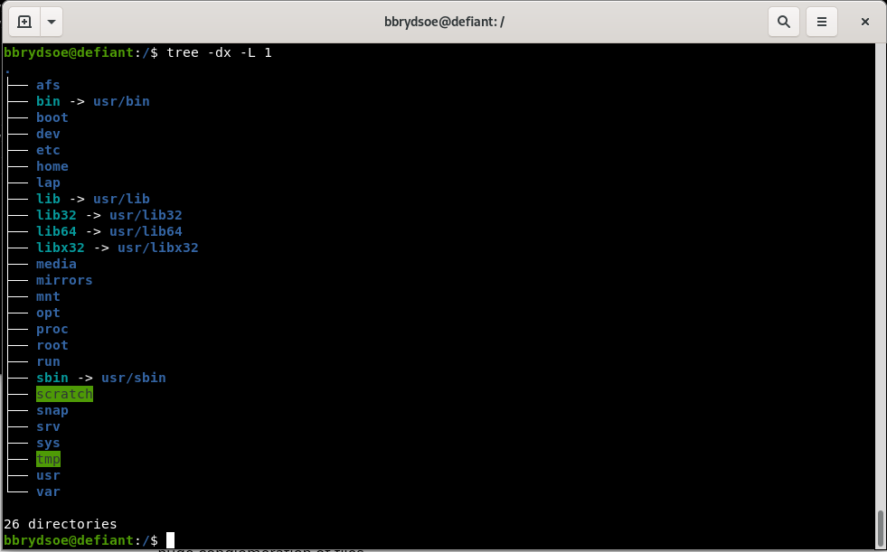
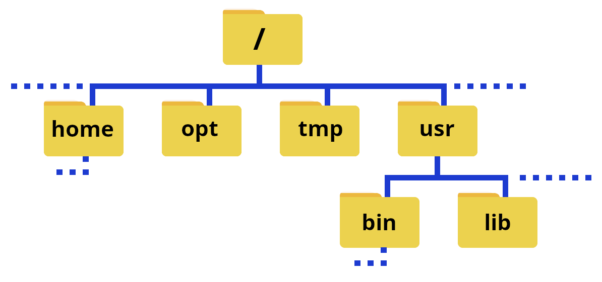
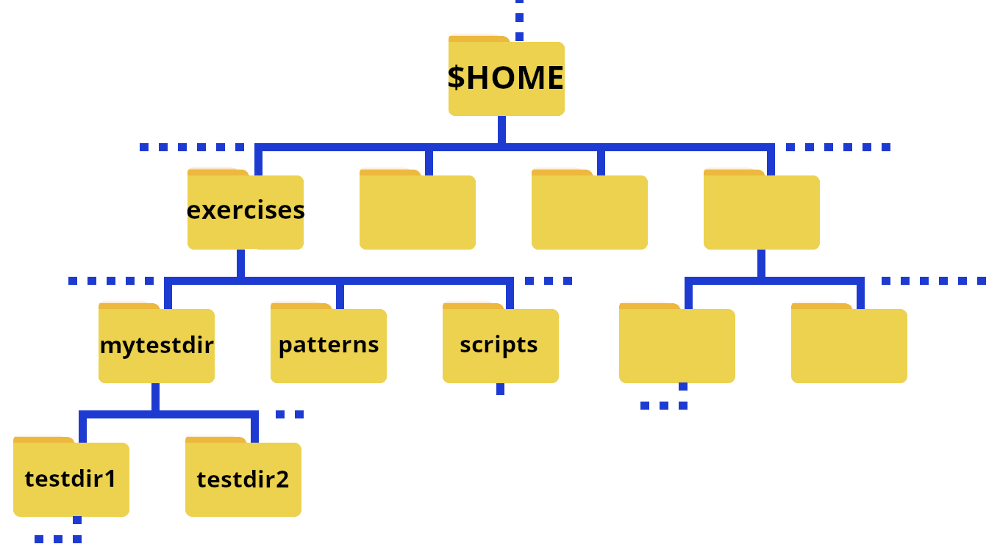

# Navigating the File System

This section is going to be a high-level talk about the Linux filesystem concepts, not a low-level description of filesystem types. 

!!! Note "Learning objectives" 

    **Questions** 

    - How do I list my files?
    - How do create and remove files and directories?
    - How do I copy/rename files and directories? 
    
    **Learning objectives** 

    - Learn how to navigate the Linux file system
    - Learn about files and directories
    - Learn about paths 
    - Be able to create and delete files and directories, as well as rename and copy them 
    - Get a brief introduction to **permissions** 
    - Learn about options (flags) and arguments to shell commands 
    - Learn about the **tab completion**
     
{: style="width: 500px;float: right"}

The Linux filesystem directory structure starts with the top root directory, which is shown as <code>/</code>. Below this are several other standard directories. Of particular interest are <code>usr/bin</code>, <code>home</code>, <code>usr/lib</code>, and <code>usr/lib64</code>. A common directory which you will also often find is <code>usr/local/bin</code>. 

The picture on the right shows typical subdirectories under <code>/</code> (note that the command 'tree' does not work at all HPC centres, though it does work on Tetralith - see the page [tree](../tree) under "Extras section for how to install if it is missing). Some of the directories have a **symbolic link** to a different name - this is often done to make it quicker to write, but can also be for compatibility reasons since some software have hardcoded paths.

!!! Note

    The ``path`` or ``pathname`` is the representation of the location of a file or folder/directory on a computer file system.
 

- **/** is the root of the directory structure on a Linux filesystem 
- **/usr/bin** contains (most) of the system-specific binaries
- **/usr/local/bin** holds non-system binaries. often locally compiled/maintained packages
- **/home** is where the home directories of the users of the system are located
- **/usr/lib** holds kernel modules and shared library images needed to boot the system and run commands in the root filesystem
- **/usr/lib64** is the same as **/usr/lib**, just for 64-bit libraries 

User-installed binaries are often located in **/opt**. 

The file system could also be illustrated like this: 

{: style="width: 500px;float: left"}

!!! warning "Note"

    The character ``/`` can be 

    1. the root directory, if it is at the front of a file or directory name 
    2. a separator if it appears inside a path. 

!!! note

    If you are on a local cluster, on an HPC centre, etc. where you are not root, you will as default be in your home directory when you login. You can use ``cd ..`` a couple times to go to the root of the system and do ``tree`` there if you want, or do ``tree`` in your home directory (you can always return there with just ``cd``). 

    Running ``tree`` in ``/`` on a supercomputing centre will probably give a very large/long output! 

### Home folders on Tetralith

{: style="width: 500px;float: left"}   
<br><br style="clear: both;">

The above shows an illustration where the home folders are emphasized. 

## Your home directory

When you login to the computer (as a non root user), you will end up in your home directory. 

The ``path`` to your home directory varies somewhat. Here are some examples for me: 

- Tetralith: ``/home/x_birbr``
- Kebnekaise: ``/home/b/bbrydsoe``
- My laptop, ncc-1701: ``/home/bbrydsoe``
- My home desktop, defiant: ``/home/bbrydsoe``

!!! note 

    You can always use the command ``pwd`` to see the actualy path! 

    You will always return to your home directory by giving the command ``cd`` and pressing enter. 

There are is also an "environment variable" that can be used as shortcut for the path: ``$HOME``. We will talk more about (environment) variables later. 

## pwd

The command ``pwd`` (print working directory) will print out the full pathname of the working directory to the screen. 

You can use this to find out which directory you are in.

### Example, in your home directory 

On Tetralith, user ``x_birbr``: 

```bash
[x_birbr@tetralith3 ~]$ pwd
/home/x_birbr
[x_birbr@tetralith3 ~]$ 
```

On Kebnekaise, user ``bbrydsoe``: 

```bash
b-an01 [~]$ pwd
/home/b/bbrydsoe
b-an01 [~]$ 
```

### Example, in a directory named ``testdir``

On Tetralith, user ``x_birbr``:

```bash
[x_birbr@tetralith3 testdir]$ pwd
/home/x_birbr/testdir
[x_birbr@tetralith3 testdir]$
```

### Example, in subdirectory ``mydir`` under directory ``testdir``

On Tetralith, user ``x_birbr``: 

```bash
[x_birbr@tetralith3 mydir]$ pwd
/home/x_birbr/testdir/mydir
[x_birbr@tetralith3 mydir]$ 
```

## cd - changing directory 

The command ``cd`` is used to change directory. 

- **cd**: Go to your home directory ($HOME)
- **cd DIR**: Change directory to DIR
- **cd ..**: Change directory to the parent directory of the current directory
- **cd -**: go back to the previous directory

!!! example

    This is the structure of the exercises directory that you got after extracting the tarball: 

    {: style="width: 500px;float: left"}
    <br><br style="clear: both;">

    Remember, $HOME is an ``environment variable`` which gives a shortcut to your home directory. 

    To change to the directory ``exercises`` when you are in your home directory, you do
    ```bash
    cd exercises
    ```

    To then change to the directory ``testdir1`` you do
    ```bash
    cd testdir1
    ```

    To quickly go back to your home directory, do 
    ```bash
    cd 
    ```

    To quickly go to a subdirectory, for instance ``exercises/testdir2`` you then do 
    ```bash
    cd exercises/testdir2
    ```

    To go to the above directory from anywhere on the system in question, do 
    ```bash
    cd $HOME/exercises/testdir2
    ```


!!! info

    You can use **full paths** (also know as **absolute paths**) or **relative paths** to give the location. 

    An absolute path makes no assumptions about your current location in relation to the location of the file or directory you want to access. It specifies the location from the root of the file system. 

    The path with reference to your current directory is called the relative path. 

## ls - listing files/directories

The ls command is used to list files. If you just give the command "ls" with no flags it will list all files in the current directory except for hidden files.

<div>
```bash
ls [flags] [directory]
```
</div>

This way you can to list files/subdirectories for any directory, but the default one is the one you are currently standing in. 

Some examples: 

- <code>ls /</code> lists contents of the root directory
- <code>ls ..</code> lists the contents of the parent directory of the current
- <code>ls ~</code> lists the contents of your user home directory
- <code>ls *</code> lists contents of current directory and subdirectories

!!! Note "Commonly used flags" 

    - <code>-d */</code> lists only directories
    - <code>-a</code> lists content including hidden files and directories
    - <code>-l</code> lists content in long table format (permissions, owners, size in bytes, modification date/time, file/directory name)
    - <code>-lh</code> adds an extra column to above representing size of each file/directory
    - <code>-t</code> lists content sorted by last modified date in descending order
    - <code>-tr</code> lists content sorted by last modified date in ascending order
    - <code>-R</code> lists contents recursively in all subdirectories
    - <code>-s</code> list files with their sizes
    - <code>-S</code> sort files/directories by size in descending order
    - <code>-Sr</code> sort files/directories by size in ascending order

To get more flags, type <code>ls \--help</code> or <code>man ls</code> in the terminal to see the manual. 

!!! tip

    You can often get more info on flags/options and usage for a Linux command with 

    - <code>COMMAND \--help</code>
    - <code>man COMMAND</code>

    where COMMAND is the Linux command you want information about, like <code>ls</code>, <code>mkdir</code>, etc. 

!!! Example "The output for a few of the flags, for a directory with two subdirectories and some files" 

    ```bash
    [x_birbr@tetralith1 mytestdir]$ ls
    myfile.txt  myotherfile.txt  testdir1  testdir2
    
    [x_birbr@tetralith1 mytestdir]$ ls -a
    ./  ../  myfile.txt  myotherfile.dat  testdir1/  testdir2/

    [x_birbr@tetralith1 mytestdir]$ ls -l
    total 3
    -rw-rw-r-- 1 x_birbr x_birbr   27 Sep 11 11:43 myfile.txt
    -rw-rw-r-- 1 x_birbr x_birbr   33 Sep 11 11:43 myotherfile.txt
    drwxrwxr-x 2 x_birbr x_birbr 4096 Sep 11 11:40 testdir1
    drwxrwxr-x 2 x_birbr x_birbr 4096 Sep 11 11:39 testdir2

    [x_birbr@tetralith1 mytestdir]$ ls -la
    total 5
    drwxrwxr-x 4 x_birbr x_birbr 4096 Sep 11 11:43 .
    drwx------ 3 x_birbr x_birbr 4096 Sep 11 11:43 ..
    -rw-rw-r-- 1 x_birbr x_birbr   27 Sep 11 11:43 myfile.txt
    -rw-rw-r-- 1 x_birbr x_birbr   33 Sep 11 11:43 myotherfile.txt
    drwxrwxr-x 2 x_birbr x_birbr 4096 Sep 11 11:40 testdir1
    drwxrwxr-x 2 x_birbr x_birbr 4096 Sep 11 11:39 testdir2

    [x_birbr@tetralith1 mytestdir]$ ls -lah
    total 5.0K
    drwxrwxr-x 4 x_birbr x_birbr 4.0K Sep 11 11:43 .
    drwx------ 3 x_birbr x_birbr 4.0K Sep 11 11:43 ..
    -rw-rw-r-- 1 x_birbr x_birbr   27 Sep 11 11:43 myfile.txt
    -rw-rw-r-- 1 x_birbr x_birbr   33 Sep 11 11:43 myotherfile.txt
    drwxrwxr-x 2 x_birbr x_birbr 4.0K Sep 11 11:40 testdir1
    drwxrwxr-x 2 x_birbr x_birbr 4.0K Sep 11 11:39 testdir2

    [x_birbr@tetralith1 mytestdir]$ ls -latr
    total 5
    drwxrwxr-x 2 x_birbr x_birbr 4096 Sep 11 11:39 testdir2
    drwxrwxr-x 2 x_birbr x_birbr 4096 Sep 11 11:40 testdir1
    -rw-rw-r-- 1 x_birbr x_birbr   27 Sep 11 11:43 myfile.txt
    -rw-rw-r-- 1 x_birbr x_birbr   33 Sep 11 11:43 myotherfile.txt
    drwx------ 3 x_birbr x_birbr 4096 Sep 11 11:43 ..
    drwxrwxr-x 4 x_birbr x_birbr 4096 Sep 11 11:43 .

    [x_birbr@tetralith1 mytestdir]$ ls *
    myfile.txt  myotherfile.dat

    testdir1:
    file1.txt  file2.sh  file3.c  file4.dat

    testdir2:
    file1.txt  file2.txt  file3.c

    [x_birbr@tetralith1 mytestdir]$ cd testdir1
    b-an01 [~/mytestdir/testdir1]$ ls -l
    total 2
    -rw-rw-r-- 1 x_birbr x_birbr 31 Sep 11 11:47 file1.txt
    -rw-rw-r-- 1 x_birbr x_birbr 16 Sep 11 11:49 file2.sh
    -rw-rw-r-- 1 x_birbr x_birbr 74 Sep 11 11:49 file3.c
    -rw-rw-r-- 1 x_birbr x_birbr 25 Sep 11 11:50 file4.dat

    [x_birbr@tetralith1 mytestdir]$ ls -ls
    total 2
    1 -rw-rw-r-- 1 x_birbr x_birbr 31 Sep 11 11:47 file1.txt
    1 -rw-rw-r-- 1 x_birbr x_birbr 16 Sep 11 11:49 file2.sh
    1 -rw-rw-r-- 1 x_birbr x_birbr 74 Sep 11 11:49 file3.c
    1 -rw-rw-r-- 1 x_birbr x_birbr 25 Sep 11 11:50 file4.dat
    ```

    The "drwxr-xr-x" and "-rw-r\--r\--" are examples of permissions. The prefex d means is it a directory. A "-" means no permission for that. There are three groups: owner, group, and all. Note that “r” is for read, “w” is for write, and “x” is for execute.  

## chmod - change permissions 

The command <code>chmod</code> is used to change permissions for files and directories. 

!!! Note "There are three types of permission groups"

    - **owners**: these permissions will only apply to owners and will not affect other groups.
    - **groups**: you can assign a group of users specific permissions, which will only impact users within the group. The members of your storage directory belongs here. 
    - **all users**: these permissions will apply to all users, so be careful with this.

!!! Note "There are three kinds of file permissions"

    - Read (r): This allows a user or a group to view a file (and so also to copy it).
    - Write (w): This permits the user to write or modify a file or directory.
    - Execute (x): A user or a group with execute permissions can execute a file. They can also view a subdirectory.  

The permissions for a file, directory, or symbolic link has 10 "bits" and looks similar to this:

{: style="width: 400px}

As shown, the first bit can be "-" (a file), "d" (a directory), or "l" (a link). 

The following group of 3 bits are for the owner, then the next 3 for the group, and then the last 3 for all users. Each can have the r(ead), w(rite), and (e)x(ecute) permission set. 

!!! Note "To change permissions, here are some examples" 

    - owner
        - **chmod +rwx FILE/DIR** to add all permissions of a file with name FILE or a directory with name DIR
        - **chmod -rwx FILE/DIR** to remove all permissions from a file with name FILE or a directory with name DIR 
        - **chmod +x FILE** to add executable permissions
        - **chmod -wx FILE** to remove write and executable permissions
    - group
        - **chmod g+rwx FILE** to add all permissions to FILE 
        - **chmod g-rwx FILE** to remove all permissions to FILE
        - **chmod g+wx FILE** to give write and execute permissions to FILE
        - **chmod g-x FILE** to remove execute permissions to FILE
    - others
        - **chmod o+rwx FILE** to add all permissions to FILE
        - **chmod o-rwx FILE** to remove all permissions to FILE
        - **chmod o+w FILE** to add write permissions to FILE
        - **chmod o-rwx DIR** to remove all permissions to DIR 
    - all
        - **chmod ugo+rwx FILE/DIR** to add all permissions for all users (owner, group, others) to file named FILE or directory named DIR
        - **chmod a=rwx FILE/DIR** same as above
        - **chmod a=r DIR** give read permissions to all for DIR 

!!! Note

    It is also possible to change the ownership of a file or a directory. We are not going to cover this here, but you can read about the command <code>chown</code> and how to use it in the "[More commands](../more-commands)" section under EXTRAS.  

## Create and remove directories/files 

This section contains a few examples of how to work with files and directories through command line interface. 

- **mkdir DIR**: Create a directory DIR
- **rm -rf DIR**: Remove a directory DIR. The flag "-r" means recursively and "-f" means do so without asking for each file and subdirectory. Useful, but dangerous. Be careful! 
- **cd**: Go to your home directory ($HOME)
- **cd DIR**: Change directory to DIR
- **cd ..**: Change directory to the parent directory of the current directory
- **cd -**: go back to the previous directory 
- **touch FILE**: create an empty file with the name FILE 

You also user "rm" to remove files; 

<div>
```bash
rm file.txt
```
</div>

The command <code>pwd</code> tells you the current directory path. 

!!! Example "Creating directories, changing directories, removing directory and file"

    **HINT: Code-along!**

    ```bash
    [x_birbr@tetralith1 ~]$ mkdir myowntestdir
    [x_birbr@tetralith1 ~]$ cd myowntestdir/
    [x_birbr@tetralith1 myowntestdir]$ mkdir testdir1
    [x_birbr@tetralith1 myowntestdir]$ mkdir testdir2
    [x_birbr@tetralith1 myowntestdir]$ mkdir testdir3
    [x_birbr@tetralith1 myowntestdir]$ rm -rf testdir3
    [x_birbr@tetralith1 myowntestdir]$ cd testdir1
    [x_birbr@tetralith1 testdir1]$ touch file1.txt
    [x_birbr@tetralith1 testdir1]$ touch file2.sh
    [x_birbr@tetralith1 testdir1]$ touch file3.c
    [x_birbr@tetralith1 testdir1]$ touch file4.dat
    [x_birbr@tetralith1 testdir1]$ touch file5.txt
    [x_birbr@tetralith1 testdir1]$ rm file5.txt 
    [x_birbr@tetralith1 testdir1]$ 
    [x_birbr@tetralith1 testdir1]$ cd ..
    [x_birbr@tetralith1 myowntestdir]$ cd testdir2/
    [x_birbr@tetralith1 testdir2]$ 
    ```

!!! Note

    This was done on Tetralith. You will notice that only the current (subdir) is shown in the prompt. At some other centres **all** the (sub)dirs would be shown. 

    Example: HPC2N
    
    ```bash
    b-an01 [~]$ cd mytestdir
    b-an01 [~/mytestdir]$ cd testdir1
    b-an01 [~/mytestdir/testdir1]$ 
    ```

## cp - copy files/directories

This command is used to copy files or directories.  

- **cp myfile.txt DIR/**: copy the file "myfile.txt" to the directory DIR
- **cp DIR1/ DIR2/**: copy the directory DIR1 into the directory DIR2 (Note: overwrites existing files with same name)
- **cp -R DIR1/ DIR2/**: copy the directory DIR1 and all subdirectories into the directory DIR2. 
- **cp -i file.txt DIR/**: Interactive. It will ask before overwriting if there is a file with the same name. 

!!! example "Code-along"

    Go to the directory ``mytestdir`` under ``exercises`` directory that you got from the downloaded tarball. This is how the structure looks: 

    {: style="width: 500px;float: left"}
    <br><br style="clear: both;">
 
    1. Change to the subdirectory: 

       ```bash
       cd exercises
       cd mytestdir
       ```
    2. Copy the file ``myfile.txt`` to the subdirectory ``testdir1``: 

       ```bash
       cp myfile.txt testdir1
       ``` 
    3. Create a new directory called ``testdir3`` inside ``testdir1``

       ```bash
       cd testdir1
       mkdir testdir3
       ```
    4. Copy the new subdirectory ``testdir3`` to the directory ``testdir2``. Remember, "testdir2" is located outside "testdir1" and at the same "level". This can be done in more than one way. Remember you need the option ``-r`` (for recursive) when copying directories:  
        a) "Go up one" and then copy: 
           ```bash
           cd ..
           cp -r testdir1/testdir3 testdir2/
           ```
        b) Copy will standing inside ``testdir1``
           ```bash
           cp -r testdir3 ../testdir2
           ```
    5. If you give the full path while copying, this can be done from anywhere.  

## mv - rename files/directories

The command <code>mv</code> is used to rename files and directories. It can also be used to **move** a file or directory to another location. 

- **mv file1.txt file2.txt**: renames <code>file1.txt</code> to <code>file2.txt</code>
- **mv DIR1/ DIR2/**: renames directory <code>DIR1</code> to directory <code>DIR2/</code>
- **mv file1.txt DIR1/**: moves the file <code>file1.txt</code> into the directory <code>DIR1/</code> 
- **mv -i file1.txt file2.txt**: interactive. Asks before overwriting if there is already a file with the destination name. 
- **mv -i DIR1/ DIR2/**: interactive. Asks before overwriting if there is already a directory with that name. 

!!! Note 

    <code>mv</code> complains if there is already a file/directory with the new name. You can force the renaming with "-f" at the cost of the disappearence of the file that previously held the name. 

### Exercise 

!!! Exercise "Exercise"

    1. Create three files (touch)
    2. Create a directory and then create a subdirectory of that directory (mkdir, cd)
    3. Create a file in the subdirectory (touch)
    4. Create another file inside the directory you created and then move it to the subdirectory you created (touch, cd, mv)
    5. Rename one of the directories (mv)
    6. Delete/remove a file (rm)
    7. Delete/remove the subdirectory (rm)  

??? note "Solution - click to reveal" 
 
    1. I am randomly naming the files ``afile.txt``, ``bfile.txt``, ``cfile.txt``
       ```bash
       touch afile.txt
       touch bfile.txt
       touch cfile.txt
       ```
    2. I am naming the directory ``newdir`` and the subdirectory ``subdir``

       ```bash 
       mkdir newdir
       cd newdir
       mkdir subdir
       ```    
    3. I am creating a file named ``newfile.dat``
    
       ```bash
       cd subdir
       touch newfile.dat
       ```
    4. I am naming the file ``secondfile.txt``

       ```bash
       cd ..
       touch secondfile.txt
       mv secondfile.txt subdir
       ```
    5. I will rename the first directory (top-level directory) I created, calling it ``fancydir`` 

       ```bash
       cd ..
       mv newdir fancydir
       ```
    6. I will remove the file ``afile.txt`` while standing "above" the directory ``fancydir`` (previously called ``newdir``) 

       ```bash
       rm fancydir/afile.txt
       ```
    7. I am removing the subdirectory ``subdir`` while standing above the directory ``fancydir``

       ```bash
       rm -r fancydir/subdir 
       ```

!!! tip

    You can always check with ``pwd`` that you are standing in the directory you think you are! 

## Symbolic links

Symbolic links are also called soft links, or just symlinks. It is a pointer to another file or directory. 

- It is useful both for ease 
    - you avoid using a long path each time you change to a directory, like your project directory
    - as well as to avoid changing hard links within other scripts or programs. This is good if you for instance install a program or use a script that assumes the library it uses is called libcoolness.a and not libcoolness.2.0.a. You can then just update the symlink instead of renaming the library or updating potentially many instances where it is mentioned in the program. 

Command:

<div>
```bash
ln -s real-file-or-lib link-name
```
</div>

!!! Example

    ```bash
    ln -s /proj/intro-linux/users/MYUSERNAME $HOME/myproj
    ```

    This creates a symbolic link named "myproj" in your home directory, pointing to the location /proj/intro-linux/users/MYUSERNAME. The directory "intro-linux" is the project storage directory for this course project. For me, this would look like this: 

    ```bash
    [x_birbr@tetralith1 ~]$ ls -l
    total 2
    lrwxrwxrwx 1 x_birbr x_birbr   31 Sep 11 12:01 myproj -> /proj/intro-linux/users/x_birbr
    drwxrwxr-x 4 x_birbr x_birbr 4096 Sep 11 11:43 mytestdir
    ```

!!! note "Keypoints"

    - Your home directory is generally located in ``/home/USERNAME`` or ``/home/U/USERNAME``
    - Your home directory can also be addressed with the environment variable ``$HOME``
    - ``pwd`` is useful for determining your path and current location
    - To change directory you use the command ``cd`` DIR
    - Just giving the command ``cd`` takes you to your homedirectory 
    - ``ls`` is used to list files and directories
    - You change permissions for files and directories with ``chmod``
    - You create a directory named DIR with ``mkdir DIR``
    - You remove a directory named DIR with ``rm -r DIR``
    - You can create an (empty) file named FILE with ``touch FILE``
    - You can remove a file named FILE with ``rm FILE``
    - The command to copy files and directories is ``cp``
    - The command to rename files and directories is ``mv`` 
    - Symbolic links are pointers to another file or directory 

