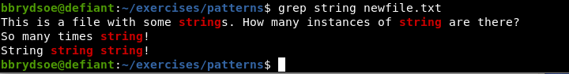

# Finding patterns

This section will look at finding patterns ([grep](#grep), [find](#find), [wild cards](#wild__cards), and [regular expressions](#regular__expressions)).  

!!! note "Learning objectives"

    **Questions** 

    - How do I find out if a specific pattern is in a file?
    - What are regular expressions?

    **Objectives** 

    - Learn about finding patterns
    - Learn to use ``grep`` and ``find``
    - Learn to use wild cards
    - Learn to use regular expressions

Here you will find descptions on how to search for files with specific patterns. 

!!! Hint "Code along!" 

    Try out / code along for some of these examples. 

    You can use the contents of the directory ``/exercises/patterns`` that you got from the downloaded tarball (<a href="https://github.com/hpc2n/linux-command-line-101/raw/refs/heads/main/exercises.tar.gz">exercises.tar.gz</a>) to play with. If you have not done so already, right-click and save to download, or right-click and copy the url, then do ``wget THE-URL-YOU-COPIED`` in a terminal window to download it there. Then do <code>tar -zxvf patterns.tar.gz</code> to unpack.  

## grep 

This command searches for patterns in text files. 

**Syntax:** 

```bash
grep [options] [FILE]
```

FILE is the name of whatever file you want to look at. 

Some commonly used options are: 

- **-i**: ignore case
- **-o**: only output the instance of the pattern you search for, not the full line 
- **-e**: use a regular expression as pattern, can be used multiple times (OR operation), protects patterns starting with "-"
- **-c**: do not output the line, just print a count of matching lines 
- **-n**: Prefix  each  line of output with the 1-based line number within its input file.
- **-r**: Read  all  files  under  each  directory, recursively. If no file operand is given, grep searches the working directory. 

See ``man grep`` for more options. 

**Examples** 

!!! tip "Code along"

    A good file to use here is ``fil.txt`` in the ``exercises/patterns`` directory. You will also use ``newfile.txt`` and ``fil.txt`` in the same directory. 

!!! Example "Find the pattern 'word' in FILE"

    ```bash
    grep 'word' FILE
    ```

!!! Example "Find the pattern 'word' recursively under the directory path/to/dir" 

    ```bash
    grep -rine 'word' path/to/dir
    ```

!!! Exercise "Try finding the pattern ``string`` in ``newfile.txt``"

    This file is also located in the ``exercises/patterns`` directory. 

??? Solution "Click to reveal solution"

    {: style="width: 400px;float: right;padding: 3px;}
     
!!! Example "Find the instances of the word 'string' in file.txt and count them"

    ```bash
    grep -o -i string file.txt | wc -l
    ```

!!! Example "Find the lines with instances of 'string' in file.txt and output them to file.out"

    ```bash
    grep string file.txt > file.out
    ```

!!! Example "Find the lines with instances of 'string' in file.txt and append them to file.out"

    ```bash
    grep string file.txt >> file.out
    ```

## find 

The ``find`` command is used for file and directory search. You can search by name, size, modification time, or content. 

**Syntax**

```bash
find [path] [options] [expression]
```

- **path** is the starting directory for the search
- **options** are settings or conditions that modify how the search is performed
- **expression** is the criteria for filtering and locating files (for instance, only search for ``txt`` files or only files named ``docs``). 

**Useful common options**

- **-type f**: only search for files
- **-type d**: only search for directories
- **-name NAME**: only search for files with a specific name NAME or pattern
- **-size [+/-]n**: Searches for files based on size. `+n` finds larger files, `-n` finds smaller files. `n` measures size in units of space.
- **-mtime n**: Finds files based on modification time. `n` represents the number of days ago.
- **-exec command {} \;**: Executes a command on each file found. 
 
For more options, check ``man find``

**Examples**

!!! tip "Try yourself"

    You could do the searches inside ``exercises`` directory or inside ``exercises/patterns`` directory. 

    1. Find the file ``myfile.txt`` in the directory you are standing in and below: 

    ```bash
    find . -type f -name "file.txt"
    ```

    2. Find the files ``myfile.txt`` as part of the name in the directory ``expressions/patterns`` while standing in ``exercises/script``

    ```bash
    find ../patterns/ -type f -name "myfile0.txt"
    ```

# Enhancing the power of ``grep`` and ``find``


## Wild cards

Wild cards are metacharacters or placeholders (<a href="https://en.wikipedia.org/wiki/Wildcard_character">Wikipedia: Wildcard</a>) used to match
one or more characters or numbers. In Linux shells, one can use them when finding patterns or when removing/listing all files of a certain type.

Wild cards are also called "glob" or "globbing" patterns. 

??? Globs

    Globs, also known as glob (or globbing) patterns (<a href="https://en.wikipedia.org/wiki/Glob_(programming)">Wikipedia: Glob</a>) are patterns 
    that can expand a wildcard pattern into a list of pathnames that match the given pattern. On the early versions of Linux, the command 
    interpreters relied on a program that expanded these characters into unquoted arguments to a command: ``/etc/glob``.


Due to their convenience, the concept of wild cards are commonly used in programming languages, however the symbols may vary between languages. Here is a list 
of wild cards in Linux:


**Common Linux wildcards**

- **?** represents a single character
- **\*** represents a string of characters (0 or more)
- **[ ]** represents a range
- **{ }** the terms are separated by commas and each term must be a wildcard or exact name
- **[!]**  matches any character that is NOT listed between the [ and ]. This is a logical NOT.
- **\\** specifies an "escape" character, when using a subsequent special character. 

!!! Warning 

    You may need quotation marks as well around some wildcards. 

!!! tip "Try some of the commands below" 

    Useful files for these examples are found in ``exercises/patterns`` 


!!! Example "Some examples of use of wildcards"

    ```bash
    myfile?.txt
    ``` 

    This matches myfile0.txt, myfile1.txt,... for all letters between a-z and numbers between 0-9. Try with ``ls myfile?.txt``. 

    ```bash
    r*d
    ```

    This matches red, rad, ronald, ... anything starting with r and ending with d, including rd. 

    ```bash
    r[a,i,o]ck
    ```

    This matches rack, rick, rock.

    ```bash
    a[d-j]a
    ```

    This matches ada, afa, aja, ...  and any three letter word that starts with an a and ends with an a and has any character d to j in between. Try with ``ls a[d-j]a``. 
   
    ```bash
    [0-9]
    ``` 
  
    This matches a range of numbers from 0 to 9. 

    ```bash
    cp {*.dat,*.c,*.pdf} ~
    ```

    This specifies to copy any files ending in .dat, .c, and .pdf to the user's homedirectory. No spaces are allowed between the commas, etc. You could test it by creating a matched file in ``patterns`` directory with ``touch file.c`` and running the above command to see it only copies that one from the ``patterns`` directory. 

    ```bash
    rm thisfile[!8]*
    ```

    This will remove all files named thisfile*, except those that has an 8 at that position in it's name. Try running it in the ``patterns`` directory! Do ``ls`` before and after to see the change. Remember, you can always recreate the directory ``patterns`` by untar'ing it again.  

    Find all files with extension ``.txt`` in the directory you are standing in and below: 

    ```bash
    find . -type f -name "*.txt"
    ```

    Find all files with ``file`` as part of the name in the directory ``expressions/patterns`` while standing in ``exercises/script``

    ```bash
    find ../patterns/ -type f -name "*file*"
    ```


## Regular Expressions

Regular Expressions are a type of patterns that are used when you are working with text. 
Due to their convenience, regular expressions are commonly used in programming languages, though their syntax may vary between languages.

Regular Expressions can be used with commands like ``grep``, ``find`` and many others. 

!!! NOTE

    If your regular expressions does not do as you expect, you may need to use single quotation marks around the sentence and you may also have to use backslashes on every single special character.

Some common examples of regular expressions: 

- **.** matches any single character. Same as **?** in standard wildcard expressions. 
- **\\** is used as an "escape" character for a subsequent special character. 
- **.*** is used to match any string, equivalent to * in standard wildcards.
- ***** the proceeding item is matched zero or more times. ie. n* will match n, nn, nnnn, nnnnnnn but not na or any other character.
- **^** means "the beginning of the line". So "^a" means find a line starting with an "a".
- **\$** means "the end of the line". So "a$" means find a line ending with an "a".
- **[ ]** specifies a range. Same as for normal wildcards. This is an 'or' relationship (you only need one to match).
- **|** This wildcard makes a logical OR relationship between wildcards. You can thus search something or something else. You may need to add a '\' before this command to avoid the shell thinking you want a pipe. 
- **[^]** This is the equivalent of [!] in standard wildcards, i.e. it is a logical “not” and will match anything not listed within the square brackets. 

!!! Example 

    ```bash
    $ cat myfile | grep '^s.*n$'
    ```

    This command searches the file myfile for lines starting with an "s" and ending with an "n", and prints them to the standard output. 

!!! note "Keypoints" 

    - Finding files with specific patterns in their names or content can be done with ``grep`` and ``find``
    - Wildcards are metacharacters for one or more character or number and are useful for when you are finding patterns or removing/copying/listing all files of a certain type 
    - Regular Expressions are a type of patterns that are used when you are working with text. They can be used with ``grep``, ``find``, and many many others 

